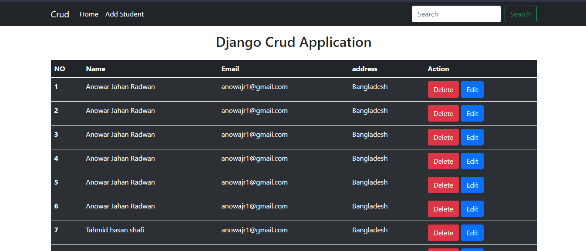
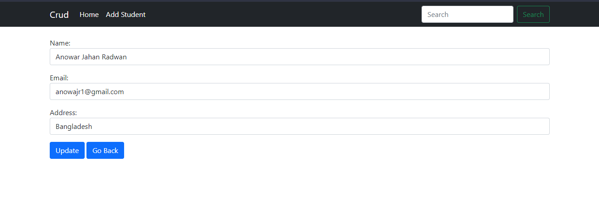

## A Simple Example of Django CRUD (Create, Retrieve, Update and Delete) Application Using Functional Based Views
***Complete Django CRUD Operations with PostgreSQL***

**Design Django Form with Bootstrap and crispy forms**

